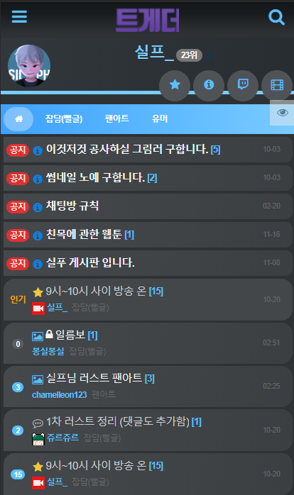

<h1 align="center">실프_ 트게더 테마</h1>
<p align="center">
    SASS(syntactically awesome stylesheets) 로 제작되었습니다.<br>
</p>

## 적용방법

### 윗칸 (데스크톱 뷰 CSS)

```css
@import url("https://k22pr.github.io/static/Tgd-Theme/theme/silphtv/styles/index.min.css");

/** 트게더 상단의 로고를 변경할 수 있습니다..**/
header .row > div:nth-child(1) > a {
  background-image: url("이미지주소");
}

/** 프로필 정보 배경의 이미지를 변경할 수 있습니다.**/
#main #main-content > div.frame div#board-info {
  background-image: url("이미지주소");
}
```

### 아래칸 (모바일 뷰 CSS)

```css
@import url("https://k22pr.github.io/static/Tgd-Theme/theme/silphtv/styles/mobile.min.css");

/** 모바일 페이지 에서의 트게더 상단의 로고를 변경할 수 있습니다..**/
html body header #header-area > a > h1 {
  background-image: url("이미지주소");
}
```

---

### 미리보기


---

### 모바일 미리보기



